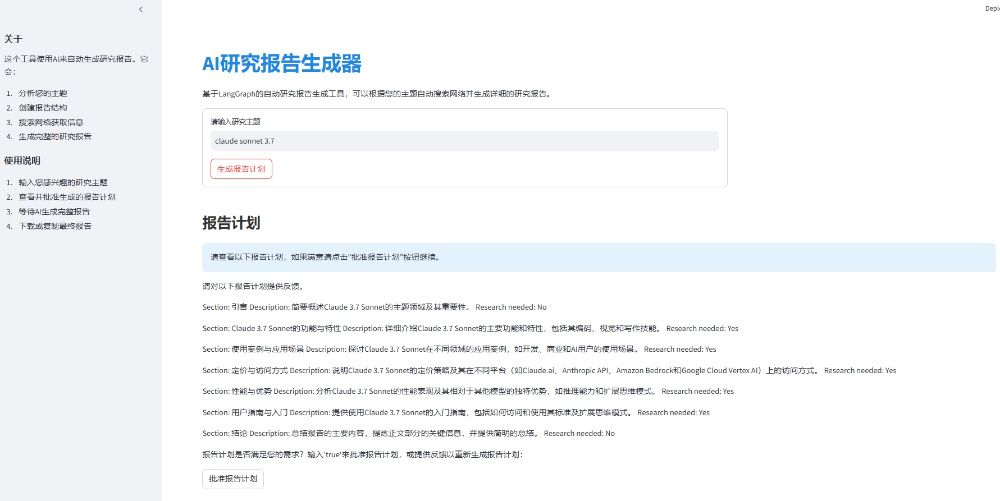
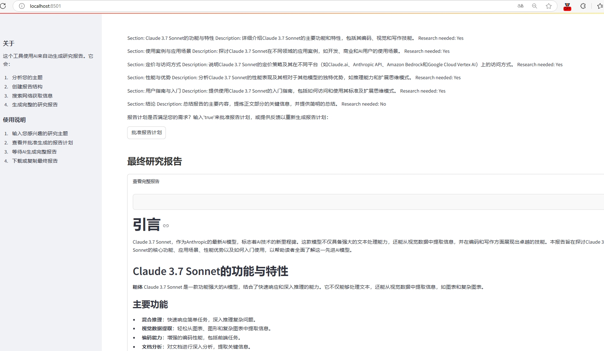

# chinese open deep research

本项目，主要基于langchain的open deep research项目改造。修改点：
1. 切换模型为中文GLM模型，部分切换为Flash模型，部分为Plus模型，理论上可以任意切换。
2. 修改所有的prompt及描述为中文
3. 修改搜索API为免费的duckduck search
4. 增加函数测试脚本，方便初学者测试每个graph node的效果。 在test_nodes.ipynb下
5. 添加steamlit运行demo

所有协议请遵循原项目 https://github.com/langchain-ai/open_deep_research/tree/main


项目仍在更新中，学习意义大于项目本身~

运行请使用：`streamlit run app.py`  或者 通过test_graph.ipynb运行

demo演示：

- 计划：


- 报告:



最后再次感谢langchain团队的开源，以及 高校X计划，高校学生、教师可获得资源包+5折模型推理的助力。


原项目README如下，

# Open Deep Research
 
Open Deep Research is a web research assistant that generates comprehensive reports on any topic following a workflow similar to [OpenAI](https://openai.com/index/introducing-deep-research/) and [Gemini](https://blog.google/products/gemini/google-gemini-deep-research/) Deep Research. However, it allows you to customize the models, prompts, report structure, search API, and research depth. Specifically, you can customize:

- provide an outline with a desired report structure
- set the planner model (e.g., DeepSeek, OpenAI reasoning model, etc)
- give feedback on the plan of report sections and iterate until user approval 
- set the search API (e.g., Tavily, Perplexity) and # of searches to run for each research iteration
- set the depth of search for each section (# of iterations of writing, reflection, search, re-write)
- customize the writer model (e.g., Anthropic)


## 🚀 Quickstart

Ensure you have API keys set for your desired tools.

Select a web search tool (by default Open Deep Research uses Tavily):

* [Tavily API](https://tavily.com/) - General web search
* [Perplexity API](https://www.perplexity.ai/hub/blog/introducing-the-sonar-pro-api) - General web search
* [Exa API](https://exa.ai/) - Powerful neural search for web content
* [ArXiv](https://arxiv.org/) - Academic papers in physics, mathematics, computer science, and more
* [PubMed](https://pubmed.ncbi.nlm.nih.gov/) - Biomedical literature from MEDLINE, life science journals, and online books
* [Linkup API](https://www.linkup.so/) - General web search

Select a writer model (by default Open Deep Research uses Anthropic Claude 3.5 Sonnet):

* [Anthropic](https://www.anthropic.com/)
* [OpenAI](https://openai.com/)
* [Groq](https://groq.com/)

Select a planner model (by default Open Deep Research uses Claude 3.7 Sonnet with thinking enabled):

* [Anthropic](https://www.anthropic.com/)
* [OpenAI](https://openai.com/)
* [Groq](https://groq.com/)

### Using the package

(Recommended: Create a virtual environment):
```bash
python -m venv open_deep_research
source open_deep_research/bin/activate
```

Install:
```bash
pip install open-deep-research
```

Ensure API keys are set for web search and planner / writer models, for example:
```bash
export TAVILY_API_KEY=<your_tavily_api_key>
export ANTHROPIC_API_KEY=<your_anthropic_api_key>
```

See [src/open_deep_research/graph.ipynb](src/open_deep_research/graph.ipynb) for an example of usage in a Jupyter notebook.

Import and compile the graph:
```python
from langgraph.checkpoint.memory import MemorySaver
from open_deep_research.graph import builder
memory = MemorySaver()
graph = builder.compile(checkpointer=memory)
```

View the graph:
```python
from IPython.display import Image, display
display(Image(graph.get_graph(xray=1).draw_mermaid_png()))
```

Run the graph with a desired topic and configuration:
```python
import uuid 
thread = {"configurable": {"thread_id": str(uuid.uuid4()),
                           "search_api": "tavily",
                           "planner_provider": "openai",
                           "planner_model": "claude-3-7-sonnet-latest",
                           "writer_provider": "anthropic",
                           "writer_model": "claude-3-5-sonnet-latest",
                           "max_search_depth": 1,
                           }}

topic = "Overview of the AI inference market with focus on Fireworks, Together.ai, Groq"
async for event in graph.astream({"topic":topic,}, thread, stream_mode="updates"):
    print(event)
    print("\n")
```

The graph will stop when the report plan is generated, and you can pass feedback to update the report plan:
```python
from langgraph.types import Command
async for event in graph.astream(Command(resume="Include a revenue estimate (ARR) in the sections"), thread, stream_mode="updates"):
    print(event)
    print("\n")
```

When you are satisfied with the report plan, you can pass `True` to proceed to report generation:
```python
# Pass True to approve the report plan and proceed to report generation
async for event in graph.astream(Command(resume=True), thread, stream_mode="updates"):
    print(event)
    print("\n")
```

### Running LangGraph Studio UI locally

Clone the repository:
```bash
git clone https://github.com/langchain-ai/open_deep_research.git
cd open_deep_research
```

Edit the `.env` file with your API keys (e.g., the API keys for default selections are shown below):

```bash
cp .env.example .env
```

Set whatever APIs needed for your model and search tool choices
```bash
export TAVILY_API_KEY=<your_tavily_api_key>
export ANTHROPIC_API_KEY=<your_anthropic_api_key>
export OPENAI_API_KEY=<your_openai_api_key>
export PERPLEXITY_API_KEY=<your_perplexity_api_key>
export EXA_API_KEY=<your_exa_api_key>
export PUBMED_API_KEY=<your_pubmed_api_key>
export PUBMED_EMAIL=<your_email@example.com>
export LINKUP_API_KEY=<your_linkup_api_key>
```

Launch the assistant with the LangGraph server locally, which will open in your browser:

#### Mac

```bash
# Install uv package manager
curl -LsSf https://astral.sh/uv/install.sh | sh

# Install dependencies and start the LangGraph server
uvx --refresh --from "langgraph-cli[inmem]" --with-editable . --python 3.11 langgraph dev
```

#### Windows

```powershell
# Install dependencies 
pip install -e .
pip install langgraph-cli[inmem]

# Start the LangGraph server
langgraph dev
```

Use this to open the Studio UI:
```
- 🚀 API: http://127.0.0.1:2024
- 🎨 Studio UI: https://smith.langchain.com/studio/?baseUrl=http://127.0.0.1:2024
- 📚 API Docs: http://127.0.0.1:2024/docs
```

(1) Provide a `Topic` and hit `Submit`:


(2) This will generate a report plan and present it to the user for review.

(3) We can pass a string (`"..."`) with feedback to regenerate the plan based on the feedback.


(4) Or, we can just pass `true` to accept the plan.


(5) Once accepted, the report sections will be generated.


The report is produced as markdown.


## 📖 Customizing the report

You can customize the research assistant's behavior through several parameters:

- `report_structure`: Define a custom structure for your report (defaults to a standard research report format)
- `number_of_queries`: Number of search queries to generate per section (default: 2)
- `max_search_depth`: Maximum number of reflection and search iterations (default: 2)
- `planner_provider`: Model provider for planning phase (default: "openai", but can be "groq")
- `planner_model`: Specific model for planning (default: "o3-mini", but can be any Groq hosted model such as "deepseek-r1-distill-llama-70b")
- `writer_model`: Model for writing the report (default: "claude-3-5-sonnet-latest")
- `search_api`: API to use for web searches (default: "tavily", options include "perplexity", "exa", "arxiv", "pubmed", "linkup")

These configurations allow you to fine-tune the research process based on your needs, from adjusting the depth of research to selecting specific AI models for different phases of report generation.

### Search API Configuration

Not all search APIs support additional configuration parameters. Here are the ones that do:

- **Exa**: `max_characters`, `num_results`, `include_domains`, `exclude_domains`, `subpages`
  - Note: `include_domains` and `exclude_domains` cannot be used together
  - Particularly useful when you need to narrow your research to specific trusted sources, ensure information accuracy, or when your research requires using specified domains (e.g., academic journals, government sites)
  - Provides AI-generated summaries tailored to your specific query, making it easier to extract relevant information from search results
- **ArXiv**: `load_max_docs`, `get_full_documents`, `load_all_available_meta`
- **PubMed**: `top_k_results`, `email`, `api_key`, `doc_content_chars_max`
- **Linkup**: `depth`

Example with Exa configuration:
```python
thread = {"configurable": {"thread_id": str(uuid.uuid4()),
                           "search_api": "exa",
                           "search_api_config": {
                               "num_results": 5,
                               "include_domains": ["nature.com", "sciencedirect.com"]
                           },
                           # Other configuration...
                           }}
```

### Model Considerations

(1) With Groq, there are token per minute (TPM) limits if you are on the `on_demand` service tier:
- The `on_demand` service tier has a limit of `6000 TPM`
- You will want a [paid plan](https://github.com/cline/cline/issues/47#issuecomment-2640992272) for section writing with Groq models

(2) `deepseek` [isn't great at function calling](https://api-docs.deepseek.com/guides/reasoning_model). Our assistant uses function calling to generate structured outputs for report sections and search queries within each section.  
- Because, section writing performs a larger number of function calls, OpenAI, Anthropic, and certain OSS models that are stromng at function calling like Groq's `llama-3.3-70b-versatile` are advised.
- If you see the following error, it is likely due to the model not being able to produce structured outputs (see [trace](https://smith.langchain.com/public/8a6da065-3b8b-4a92-8df7-5468da336cbe/r)):
```
groq.APIError: Failed to call a function. Please adjust your prompt. See 'failed_generation' for more details.
```

## How it works
   
1. `Plan and Execute` - Open Deep Research follows a [plan-and-execute workflow](https://github.com/assafelovic/gpt-researcher) that separates planning from research, allowing for human-in-the-loop approval of a report plan before the more time-consuming research phase. It uses, by default, a [reasoning model](https://www.youtube.com/watch?v=f0RbwrBcFmc) to plan the report sections. During this phase, it uses web search to gather general information about the report topic to help in planning the report sections. But, it also accepts a report structure from the user to help guide the report sections as well as human feedback on the report plan.
   
2. `Research and Write` - Each section of the report is written in parallel. The research assistant uses web search via [Tavily API](https://tavily.com/), [Perplexity](https://www.perplexity.ai/hub/blog/introducing-the-sonar-pro-api), [Exa](https://exa.ai/), [ArXiv](https://arxiv.org/), [PubMed](https://pubmed.ncbi.nlm.nih.gov/) or [Linkup](https://www.linkup.so/) to gather information about each section topic. It will reflect on each report section and suggest follow-up questions for web search. This "depth" of research will proceed for any many iterations as the user wants. Any final sections, such as introductions and conclusions, are written after the main body of the report is written, which helps ensure that the report is cohesive and coherent. The planner determines main body versus final sections during the planning phase.

3. `Managing different types` - Open Deep Research is built on LangGraph, which has native support for configuration management [using assistants](https://langchain-ai.github.io/langgraph/concepts/assistants/). The report `structure` is a field in the graph configuration, which allows users to create different assistants for different types of reports. 

## UX

### Local deployment

Follow the [quickstart](#-quickstart) to start LangGraph server locally.

### Hosted deployment
 
You can easily deploy to [LangGraph Platform](https://langchain-ai.github.io/langgraph/concepts/#deployment-options). 

